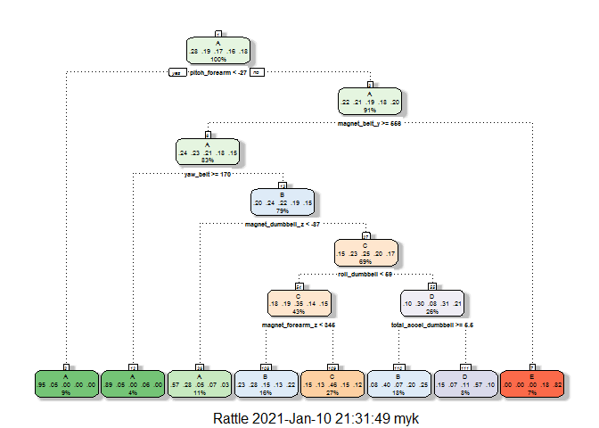
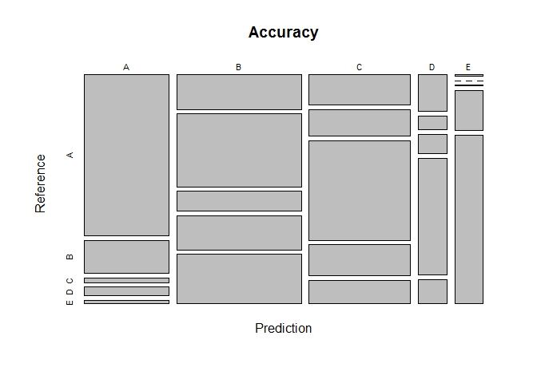
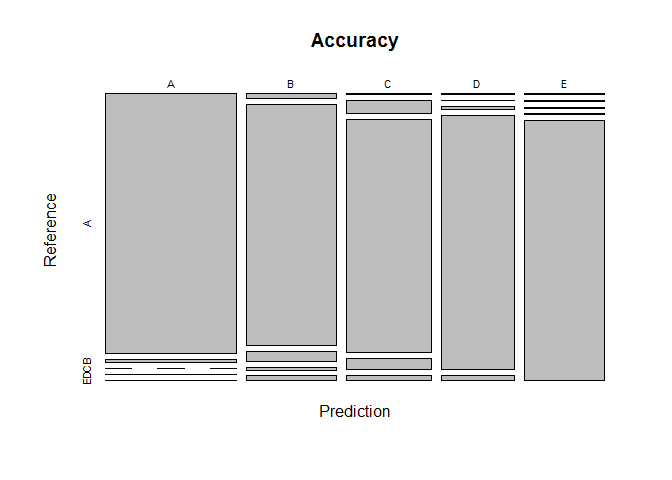
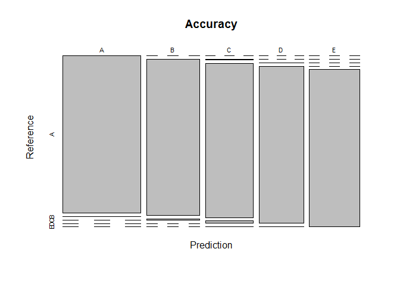

### Introduction

Using devices such as Jawbone Up, Nike FuelBand, and Fitbit it is now possible to collect a large amount of data about personal activity relatively inexpensively. These type of devices are part of the quantified self movement – a group of enthusiasts who take measurements about themselves regularly to improve their health, to find patterns in their behavior, or because they are tech geeks. One thing that people regularly do is quantify how much of a particular activity they do, but they rarely quantify how well they do it. In this project, goal will be to use data from accelerometers on the belt, forearm, arm, and dumbell of 6 participants. They were asked to perform barbell lifts correctly and incorrectly in 5 different ways. More information is available from the website: [http://groupware.les.inf.puc-rio.br/har](http://groupware.les.inf.puc-rio.br/har). 

### Methodology

2 datasets are used in this project. First is training dataset to train our model which will be divided into two parts, one (75% dataset) to train our model and other (25% dataset) to validate it. Second dataset is testing dataset containing 20 observations whose outcome will be predicted to answer *Prediction Quiz on Coursera*. Outcome in our dataset is named by *classe*.

**Methodology Steps:-**

* Loading packages

* Loading raw data

* Data pre-processing includes removing four kinds of columns

  + empty columns

  + columns containing NA values
  
  + columns representing highly correlated predictors
  
  + columns containing non-predictors
  
* Splitting training data into two parts as discussed above

* Performing cross validation, "cv" method is used

* Fitting machine learning models and choosing the most accurate

Dataset courtesy to:- Velloso, E.; Bulling, A.; Gellersen, H.; Ugulino, W.; Fuks, H. Qualitative Activity Recognition of Weight Lifting Exercises. Proceedings of 4th International Conference in Cooperation with SIGCHI (Augmented Human '13) . Stuttgart, Germany: ACM SIGCHI, 2013.

For more information on methodology used in this project, click [https://topepo.github.io/caret/pre-processing.html](here).

### Loading Packages


```r
library(caret); library(ggplot2); library(rattle)
```

### Loading Raw Data


```r
training_raw <- read.csv("pml-training.csv")
dim(training_raw)
```

```
## [1] 19622   160
```

```r
testing_raw <- read.csv("pml-testing.csv")
dim(testing_raw)
```

```
## [1]  20 160
```

### Data Pre-processing

#### Removing columns having some NA values

```r
tr <- training_raw[ , colSums(is.na(training_raw)) == 0]
dim(tr)
```

```
## [1] 19622    93
```

```r
te <- testing_raw[ , colSums(is.na(testing_raw)) == 0]
dim(te)
```

```
## [1] 20 60
```

#### Removing first 7 non-predictor columns

```r
tr <- tr[,-c(1:7)]
dim(tr)
```

```
## [1] 19622    86
```

```r
te <- te[,-c(1:7)]
dim(te)
```

```
## [1] 20 53
```

#### Eliminating empty columns in training dataset

```r
nzv <- nearZeroVar(tr, saveMetrics= TRUE)
tr <- tr[,!nzv[,4]]
dim(tr)
```

```
## [1] 19622    53
```

#### Eliminating highly correlated predictors

```r
descrCor <- cor(tr[,-dim(tr)[2]])
highlyCorDescr <- findCorrelation(descrCor, cutoff = .75)
tr <- tr[,-highlyCorDescr]
dim(tr)
```

```
## [1] 19622    32
```

```r
te <- te[,-highlyCorDescr]
dim(te)
```

```
## [1] 20 32
```

### Spliting training data into training & validation

```r
set.seed(123)
inTrain <- createDataPartition(y = tr$classe, p = .75, list = FALSE)
training <- tr[inTrain,]
dim(training)
```

```
## [1] 14718    32
```

```r
validation <- tr[-inTrain,]
dim(validation)
```

```
## [1] 4904   32
```

### Cross Validation

```r
fitControl <- trainControl(method = "cv", number = 5)
```

### Machine Learning

Following 3 models will be used to fit and predict data:

* Decision tree

* Gradient boosting method

* Random forest

**confx$table** output compares observed and predicted outcome.

**confx$overall[1]** output gives model accuracy.

#### Model 1 - Decision Tree

```r
set.seed(124)
fit1 <- train(classe ~ ., method="rpart", data=training, trControl=fitControl)
fancyRpartPlot(fit1$finalModel)
```

<!-- -->

```r
pred1 <- predict(fit1,newdata=validation)
conf1 <- confusionMatrix(pred1,factor(validation$classe))
conf1$table
```

```
##           Reference
## Prediction   A   B   C   D   E
##          A 860 175  26  47  18
##          B 273 577 156 271 392
##          C 192 172 636 198 151
##          D  68  25  36 218  45
##          E   2   0   1  70 295
```

```r
conf1$overall[1]
```

```
##  Accuracy 
## 0.5273246
```

```r
plot(conf1$table, main="Accuracy")
```

<!-- -->

#### Model 2 - Gradient Boosting Method

```r
set.seed(125)
fit2 <- train(classe ~ ., method="gbm", data=training, trControl=fitControl, verbose=FALSE)
pred2 <- predict(fit2,newdata=validation)
conf2 <- confusionMatrix(pred2,factor(validation$classe))
conf2$table
```

```
##           Reference
## Prediction    A    B    C    D    E
##          A 1371   19    0    1    4
##          B   17  879   38   11   18
##          C    3   44  807   38   19
##          D    2    2    8  751   17
##          E    2    5    2    3  843
```

```r
conf2$overall[1]
```

```
##  Accuracy 
## 0.9484095
```

```r
plot(conf2$table, main="Accuracy")
```

<!-- -->

#### Model 3 - Random Forest

```r
set.seed(126)
fit3 <- train(classe ~ ., method="rf", data=training, trControl=fitControl, verbose=FALSE)
pred3 <- predict(fit3,newdata=validation)
conf3 <- confusionMatrix(pred3,factor(validation$classe))
conf3$table
```

```
##           Reference
## Prediction    A    B    C    D    E
##          A 1395    2    0    0    0
##          B    0  943    8    0    0
##          C    0    4  846   13    1
##          D    0    0    1  791    1
##          E    0    0    0    0  899
```

```r
conf3$overall[1]
```

```
##  Accuracy 
## 0.9938825
```

```r
plot(conf3$table, main="Accuracy")
```

<!-- -->

#### **Random forest will be used since it has the best accuracy.**
